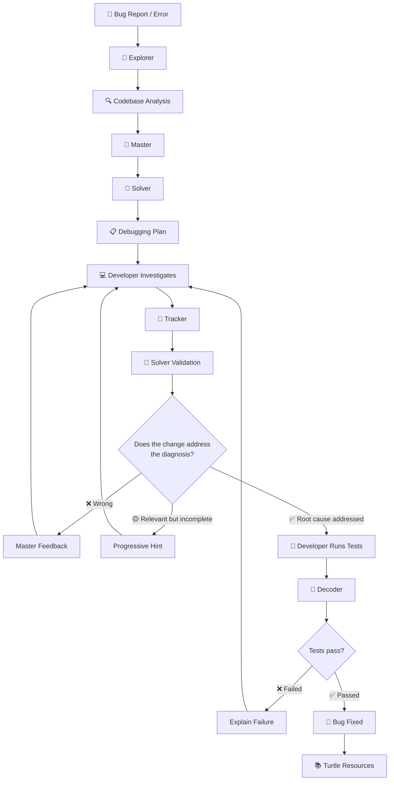
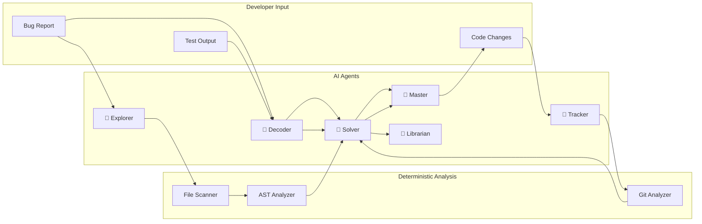
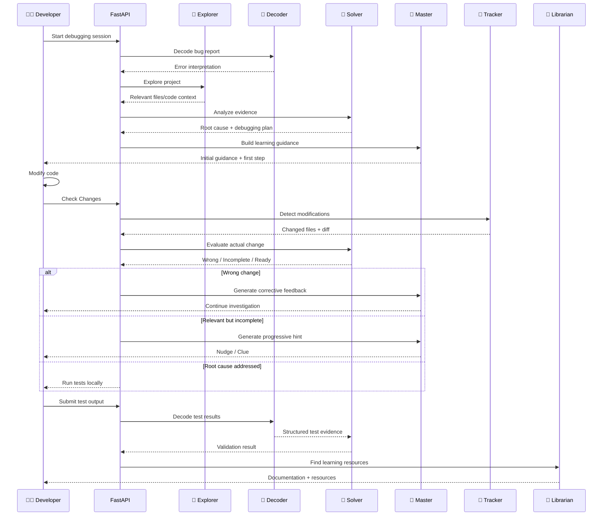
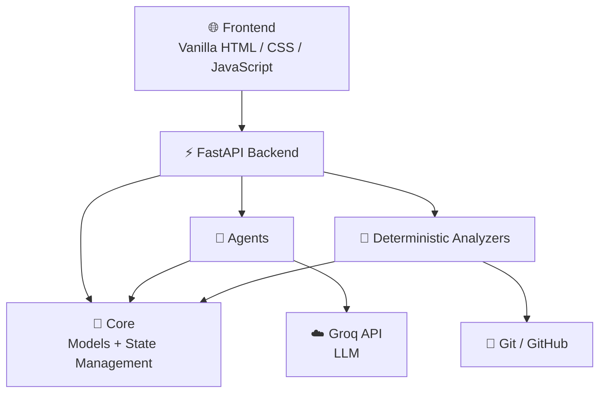
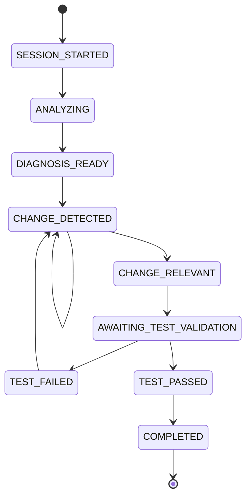
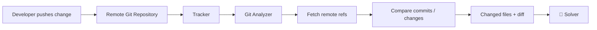

<p align="center">
  
</p>

<h1 align="center">Debug2Learn</h1>

<p align="center">
  <strong>Don't let AI fix your bugs. Let AI teach you to fix them.</strong>
</p>

<p align="center">
  An AI-powered educational debugging game that turns debugging into an interactive learning experience.
</p>

<p align="center">
  🦁 Explore · 🐼 Decode · 🦊 Solve · 🦉 Learn · 🦅 Track · 🐢 Discover
</p>

---

## 🎯 What is Debug2Learn?

Debug2Learn is an **AI-powered debugging game** built to teach developers the reasoning behind debugging—not just provide the final fix.

Instead of automatically correcting broken code, Debug2Learn guides the developer through the debugging process:

**Error → Investigation → Diagnosis → Hints → Code Change → Validation → Learning**

Six specialized AI characters work together throughout the journey, each responsible for a different part of the debugging workflow.


---

## 🎯 The Problem

Traditional AI coding assistants often solve bugs directly:

> ❌ Error → AI writes the fix → Developer copies it.

This can solve the immediate problem without teaching the developer how to reason about it.

Debug2Learn takes a different approach:

> ✅ Error → Understand → Investigate → Form a hypothesis → Make a change → Validate → Learn

The developer remains responsible for writing the fix while AI acts as a **teacher, investigator, and feedback system**.

---

# 🌿 How It Works



---

# 🐯 The Debugging Jungle

Debug2Learn uses six specialized characters.

| Character     | Role      | Responsibility                                      |
| ------------- | --------- | --------------------------------------------------- |
| 🦁 **Lion**   | Explorer  | Explores the project and identifies relevant files  |
| 🦉 **Owl**    | Master    | Main Socratic mentor and learning guide             |
| 🐼 **Panda**  | Decoder   | Decodes errors, tracebacks, and test output         |
| 🦊 **Fox**    | Solver    | Performs root-cause reasoning and validates changes |
| 🦅 **Eagle**  | Tracker   | Detects and summarizes developer changes            |
| 🐢 **Turtle** | Librarian | Finds relevant documentation and learning resources |

### Deterministic analyzers

The AI agents are supported by deterministic utilities:

- `ASTAnalyzer` — Python AST and symbol analysis
- `GitAnalyzer` — local and remote Git change detection
- `FileScanner` — project/file discovery

These are **not AI agents**. They provide structured evidence to the agents.

---

# 🧠 Agent Architecture



---

# 🔄 Core Debugging Pipeline

The debugging lifecycle is intentionally separated into **diagnosis**, **change tracking**, **validation**, and **test verification**.



---

# 🧩 Validation Model

A key principle of Debug2Learn is that **changing a relevant file is not the same as fixing the bug**.

The validation pipeline is:

```text
Developer Change
       │
       ▼
🎯 Tracker
Detects what actually changed
       │
       ▼
🦊 Solver
Compares the change with the original diagnosis
       │
       ├───────────────┐
       ▼               ▼
   ❌ Wrong       🟡 Incomplete
       │               │
       └───────┬───────┘
               ▼
          🦉 Master
       Learning feedback
               │
               ▼
        Developer tries again

               OR

       🟢 Root cause addressed
               │
               ▼
        Developer runs tests
               │
               ▼
          🐼 Decoder
       Interprets output
               │
               ▼
          🦊 Solver
       Final verification
               │
               ▼
          🎉 Success
```

### Important distinction

| Stage               | Question                                           |
| ------------------- | -------------------------------------------------- |
| Explorer            | Where should we investigate?                       |
| Decoder             | What does this error/test output mean?             |
| Solver — Diagnosis  | Why is the program failing?                        |
| Tracker             | What did the developer actually change?            |
| Solver — Validation | Does that change address the diagnosed root cause? |
| Tests               | Does the resulting behavior actually work?         |
| Librarian           | What should the developer learn next?              |

---

# 💡 Progressive Hints

Debug2Learn does not immediately reveal the solution.

Hints progress from less explicit to more explicit guidance:

```text
Level 1
   ↓
💡 Nudge
"What part of the reported failure should you inspect?"

   ↓

Level 2
   ↓
🔎 Clue
"Look at the code involved in the failing operation."

   ↓

Level 3
   ↓
🧩 Direct Clue
"Inspect the specific function/symbol identified in the diagnosis."
```

The goal is to preserve the developer's reasoning process.

---

# 🏗️ Project Architecture



---

# 📁 Project Structure

```text
debug2learn/
│
├── debug2learn/
│   │
│   ├── agents/
│   │   ├── __init__.py
│   │   ├── base.py
│   │   ├── explorer.py
│   │   ├── decoder.py
│   │   ├── master.py
│   │   ├── solver.py
│   │   ├── tracker.py
│   │   └── librarian.py
│   │
│   ├── analyzers/
│   │   ├── __init__.py
│   │   ├── ast_analyzer.py
│   │   ├── file_scanner.py
│   │   └── git_analyzer.py
│   │
│   ├── config/
│   │   ├── __init__.py
│   │   └── settings.py
│   │
│   ├── core/
│   │   ├── __init__.py
│   │   ├── models.py
│   │   └── state.py
│   │
│   ├── __init__.py
│   └── server.py
│
├── frontend/
│   ├── index.html
│   ├── style.css
│   ├── app.js
│   └── assets/
│       ├── lion.svg
│       ├── panda.svg
│       ├── owl.svg
│       ├── fox.svg
│       ├── eagle.svg
│       └── turtle.svg
│
├── tests/
│   ├── ...
│   └── ...
│
├── requirements.txt
├── Dockerfile
├── .env.example
├── .gitignore
└── README.md
```

---

# 🛠️ Technology Stack

## Backend

- **Python**
- **FastAPI**
- **Pydantic**
- **Uvicorn**
- **GitPython / Git CLI integration**
- **Python AST**

## AI

- **Groq API**
- Default model:

```text
openai/gpt-oss-120b
```

The model can be changed through environment configuration.

## Frontend

- HTML5
- CSS3
- Vanilla JavaScript
- SVG game characters

No frontend framework is required for the MVP.

## Deployment

```text
GitHub
   │
   ▼
Render
   │
   ▼
FastAPI
   │
   ▼
Groq API
```

Frontend:

```text
GitHub Pages
   │
   ▼
Debug2Learn Web UI
   │
   ▼
Render Backend
```

---

# 🚀 Getting Started

## Requirements

- Python 3.11+
- Git
- A Groq API key

---

## 1. Clone the repository

```bash
git clone https://github.com/MohamedAli1937/debug2learn.git
cd debug2learn
```

---

## 2. Create a virtual environment

### Windows

```bash
python -m venv .venv
.venv\Scripts\activate
```

### Linux / macOS

```bash
python3 -m venv .venv
source .venv/bin/activate
```

---

## 3. Install dependencies

```bash
pip install -r requirements.txt
```

---

## 4. Configure environment variables

Create `.env`:

```env
GROQ_API_KEY=your_groq_api_key
GROQ_MODEL=openai/gpt-oss-120b
```

Never commit `.env` or API keys to GitHub.

---

# ▶️ Run the Backend

```bash
uvicorn debug2learn.server:app --reload --port 8000
```

Backend:

```text
http://localhost:8000
```

API documentation:

```text
http://localhost:8000/docs
```

---

# 🌐 Run the Frontend

The frontend is static and can be served with any static HTTP server.

For example:

```bash
python -m http.server 5500 --directory frontend
```

Then open:

```text
http://localhost:5500
```

The frontend communicates with the FastAPI backend through the configured API endpoint.

---

# 🔌 API

## Start Session

```http
POST /api/start
```

Starts a debugging session.

Example:

```json
{
  "project_url": "https://github.com/example/project",
  "bug_report": "Tests fail with an ImportError."
}
```

The API also supports local project paths where configured.

---

## Request Hint

```http
POST /api/hint
```

Returns the next progressive hint based on the current debugging state.

---

## Check Changes

```http
POST /api/check
```

Checks whether the developer has made a change.

Pipeline:

```text
🎯 Tracker
   ↓
Change Detection
   ↓
🦊 Solver
   ↓
Change vs Diagnosis
   ↓
Validation State
```

Possible states include:

```text
CHANGE_DETECTED
CHANGE_RELEVANT
AWAITING_TEST_VALIDATION
```

---

## Submit Test Output

```http
POST /api/test
```

The developer runs tests locally and submits the output.

Debug2Learn does **not** execute arbitrary developer code on the server.

Example:

```json
{
  "output": "3 passed in 0.42s"
}
```

---

## Ask Master

```http
POST /api/ask
```

Allows the developer to ask the Master a debugging question.

The answer is grounded in the current debugging plan and session context.

---

## Debugging Plan

```http
GET /api/plan
```

Returns the current debugging plan.

---

## Learning Resources

```http
GET /api/resources
```

Returns resources selected according to the diagnosed debugging concept.

---

## Session Status

```http
GET /api/status
```

Returns the current session state.

---

# 🔐 Security Model

Debug2Learn is designed so the backend does **not execute arbitrary code supplied by the developer**.

Instead:

```text
Developer
   │
   ├── edits project
   │
   ├── runs tests locally
   │
   └── submits test output
              │
              ▼
        Debug2Learn
              │
              ▼
       Analyze / Explain
```

This is preferable to blindly executing uploaded code inside the backend.

### API secrets

Secrets should be stored in environment variables:

```env
GROQ_API_KEY=...
```

Do not commit credentials.

---

# 🧪 Testing Strategy

Debug2Learn separates several types of testing.

### Unit tests

Test individual analyzers, agents, and utilities.

```bash
pytest
```

### AST analysis

Verify that code changes are correctly identified at the symbol level.

### Git analysis

Verify:

- working-tree changes
- staged changes
- remote changes
- changed files
- diffs

### Agent validation

Verify that Solver does not consider a change correct simply because:

- the relevant file changed
- a similarly named function was added
- the developer claims it is fixed
- the code looks superficially plausible

The original diagnosis remains the reference point.

---

# 🧠 Example Debugging Session

Suppose a project reports:

```text
ImportError: cannot import name 'remove_task' from 'todo'
```

Debug2Learn can reason through the problem without immediately writing the fix.

### Step 1 — Decoder

🐼 identifies:

```text
ImportError
```

and extracts the missing symbol:

```text
remove_task
```

### Step 2 — Explorer

🦁 identifies the relevant files:

```text
todo.py
test_todo.py
```

### Step 3 — Solver

🦊 builds a diagnosis:

```text
Hypothesis:
test_todo.py imports remove_task,
but todo.py does not define it.
```

### Step 4 — Master

🦉 guides the developer toward the relevant code instead of directly solving it.

### Step 5 — Developer change

The developer modifies the project.

### Step 6 — Tracker

🦅 detects:

```text
todo.py modified
```

and produces the actual diff.

### Step 7 — Solver validation

🦊 compares the actual modification against the diagnosis.

A change such as:

```python
def delete_task(...):
    ...
```

does not automatically count as a fix because the diagnosed missing symbol was:

```text
remove_task
```

### Step 8 — Tests

The developer runs:

```bash
pytest
```

and submits the output.

### Step 9 — Decoder + Solver

🐼 interprets the output.

🦊 performs final validation.

```text
3 passed
```

→ 🎉 debugging quest completed.

---

# 📊 State Machine



---

# 🎮 Educational Design Principles

## 1. AI teaches; developer codes

The AI should guide reasoning rather than automatically implement the solution.

## 2. Diagnosis and validation are separate

Finding the cause of a bug is different from verifying a proposed fix.

## 3. Tests remain the behavioral authority

Solver can determine whether a change addresses the diagnosis, but successful tests provide the final behavioral evidence.

## 4. Evidence over assumptions

The system uses:

- traceback information
- project structure
- AST analysis
- actual code
- Git diffs
- test output

rather than relying only on the developer's description.

## 5. Progressive disclosure

The system avoids immediately revealing the answer and gradually increases hint specificity.

---

# 🌍 Deployment

## Backend — Render

```text
GitHub Repository
       │
       ▼
MohamedAli1937/debug2learn
       │
       ▼
Render
       │
       ▼
FastAPI + Uvicorn
       │
       ▼
Groq
```

The backend uses the Render-provided `$PORT` and listens on:

```text
0.0.0.0
```

### Environment

```env
GROQ_API_KEY=...
GROQ_MODEL=openai/gpt-oss-120b
```

---

## Frontend — GitHub Pages

```text
GitHub Pages
      │
      ▼
Debug2Learn UI
      │
      ▼
Render API
```

Production frontend:

```text
https://mohamedali1937.github.io/debug2learn/
```

Backend:

```text
https://debug2learn.onrender.com
```

---

# 🐙 Git-Based Change Tracking

Debug2Learn can inspect Git changes without automatically modifying the developer's repository.



The Tracker's responsibility is limited to:

> **What changed?**

The Solver's responsibility is:

> **Does the change address the diagnosed problem?**

This separation prevents the change detector from making correctness decisions.

---

# 📚 Learning Resources

The Librarian uses the Solver's diagnosis to identify relevant documentation.

For example:

```text
Diagnosis
    ↓
Concept
    ↓
Official documentation
    ↓
Learning resource
```

Resources should be connected to the actual debugging concept rather than arbitrary programming topics.

---

# 🧱 Design Philosophy

Debug2Learn is built around four layers:

```text
┌─────────────────────────────────────┐
│          🎮 EXPERIENCE              │
│      Game + Characters + UI         │
├─────────────────────────────────────┤
│          🧠 INTELLIGENCE            │
│     AI Agents + Debugging Plan      │
├─────────────────────────────────────┤
│          🔬 EVIDENCE                │
│ AST + Git + Files + Test Output     │
├─────────────────────────────────────┤
│          ⚙️ INFRASTRUCTURE          │
│       FastAPI + Groq + Git          │
└─────────────────────────────────────┘
```

---

# 🗺️ Future Roadmap

Potential future improvements:

- [ ] Persistent user profiles
- [ ] Multiple programming languages
- [ ] Interactive code editor
- [ ] Sandboxed test execution
- [ ] More debugging scenarios
- [ ] Difficulty levels
- [ ] XP and achievement system
- [ ] Debugging streaks
- [ ] Multiplayer debugging quests
- [ ] More deterministic validation rules
- [ ] Richer AST analysis
- [ ] GitHub OAuth integration
- [ ] Repository-based debugging challenges
- [ ] Learning analytics
- [ ] Adaptive difficulty

---

# 🏆 Hackathon MVP

The current MVP focuses on demonstrating the core educational loop:

```text
🐛 Bug
 ↓
🔍 Understand
 ↓
🧠 Diagnose
 ↓
💡 Learn
 ↓
💻 Developer fixes
 ↓
🎯 Track
 ↓
🧩 Validate
 ↓
🧪 Test
 ↓
🎉 Learn
```

The objective is not to replace the developer.

It is to make the developer **better at debugging**.

---

# 👨‍💻 Project

**Debug2Learn**

Built for the **COME. BUILD. WITH AI.** hackathon.

### Tagline

> **Don't let AI fix your bugs. Let AI teach you to fix them.**

---

## License

Add the project's chosen license here before public distribution.

---

## Acknowledgements

Built with:

- Python
- FastAPI
- Groq
- Git
- Python AST
- HTML / CSS / JavaScript
- SVG

And, most importantly:

**human debugging. 🧠🐾**
