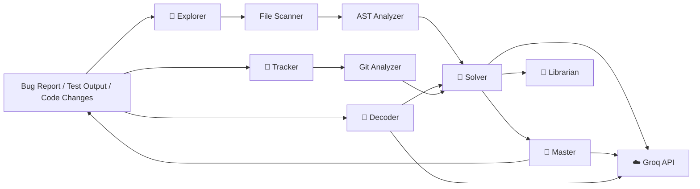

<p align="center">
  
</p>

<h1 align="center">Debug2Learn</h1>

<p align="center">
  <strong>Don't let AI fix your bugs. Let AI teach you to fix them.</strong>
</p>

<p align="center">
  An AI-powered educational debugging platform that turns debugging into an interactive learning experience.
</p>

---

## 🎯 What is Debug2Learn?

Debug2Learn is an **AI-powered debugging platform** designed to teach developers how to reason about bugs instead of simply generating fixes.

The developer remains responsible for solving the problem while AI provides:

**Error → Investigation → Diagnosis → Hints → Developer Change → Validation → Learning**

The system combines AI agents with deterministic code-analysis tools to provide evidence-based debugging guidance.

---

## 🐾 The Debugging Jungle

Debug2Learn uses six specialized AI characters:

| Character     | Role      | Responsibility                              |
| ------------- | --------- | ------------------------------------------- |
| 🦁 **Lion**   | Explorer  | Finds relevant files and code               |
| 🦉 **Owl**    | Master    | Provides Socratic guidance                  |
| 🐼 **Panda**  | Decoder   | Interprets errors and test output           |
| 🦊 **Fox**    | Solver    | Performs root-cause analysis and validation |
| 🦅 **Eagle**  | Tracker   | Tracks developer changes                    |
| 🐢 **Turtle** | Librarian | Finds relevant learning resources           |

### Deterministic analyzers

These are not AI agents. They provide structured evidence:

- `ASTAnalyzer` — Python AST and symbol analysis
- `GitAnalyzer` — Git changes and diffs
- `FileScanner` — project and file discovery

---

## 🧠 Architecture



---

## 🔄 Debugging Workflow

```text
🐛 Bug Report
     ↓
🐼 Decode Error
     ↓
🦁 Explore Codebase
     ↓
🦊 Diagnose Root Cause
     ↓
🦉 Guide Developer
     ↓
💻 Developer Changes Code
     ↓
🦅 Track Changes
     ↓
🦊 Validate Against Diagnosis
     ↓
🧪 Developer Runs Tests
     ↓
🐼 Decode Results
     ↓
🎉 Learn & Complete
```

A key principle is:

> **Changing the relevant file does not necessarily mean the bug is fixed.**

The Solver compares the developer's actual changes with the original diagnosis before considering the change relevant.

---

## 💡 Progressive Hints

Debug2Learn avoids immediately revealing the solution.

```text
Level 1 → Nudge
"What part of the failure should you inspect?"

Level 2 → Clue
"Look at the code involved in the failing operation."

Level 3 → Direct Clue
"Inspect the function identified in the diagnosis."
```

This preserves the developer's reasoning process.

---

## 🏗️ Project Structure

```text
debug2learn/
├── backend/
│   ├── agents/
│   │   ├── base.py
│   │   ├── explorer.py
│   │   ├── decoder.py
│   │   ├── master.py
│   │   ├── solver.py
│   │   ├── tracker.py
│   │   └── librarian.py
│   │
│   ├── analyzers/
│   │   ├── ast_analyzer.py
│   │   ├── file_scanner.py
│   │   └── git_analyzer.py
│   │
│   ├── config/
│   └── core/
│
├── frontend/
│   └── index.html
│
├── assets/
├── tests/
├── app.py
├── Dockerfile
├── main.py
├── README.md
├── render.yaml
├── requirements.txt
└── server.py
```

---

## 🛠️ Technology Stack

### Backend

- Python
- FastAPI
- Pydantic
- Uvicorn
- GitPython / Git CLI
- Python AST

### AI

- Groq API
- Default model: `openai/gpt-oss-120b`

### Frontend

- HTML5
- CSS3
- Vanilla JavaScript
- SVG

### Deployment

```text
GitHub → Render → FastAPI → Groq
GitHub Pages → Frontend → Render API
```

---

## 🚀 Getting Started

### Requirements

- Python 3.11+
- Git
- Groq API key

### Clone

```bash
git clone https://github.com/MohamedAli1937/debug2learn.git
cd debug2learn
```

### Virtual environment

**Windows**

```bash
python -m venv .venv
.venv\Scripts\activate
```

**Linux / macOS**

```bash
python3 -m venv .venv
source .venv/bin/activate
```

### Install dependencies

```bash
pip install -r requirements.txt
```

### Configure environment

Create `.env`:

```env
GROQ_API_KEY=your_groq_api_key
GROQ_MODEL=openai/gpt-oss-120b
```

Never commit API keys or `.env`.

---

## ▶️ Run

### Backend

```bash
uvicorn debug2learn.server:app --reload --port 8000
```

API:

```text
http://localhost:8000
http://localhost:8000/docs
```

### Frontend

```bash
python -m http.server 5500 --directory frontend
```

Then open:

```text
http://localhost:5500
```

---

## 🔌 API

| Endpoint             | Purpose                       |
| -------------------- | ----------------------------- |
| `POST /api/start`    | Start a debugging session     |
| `POST /api/hint`     | Get the next progressive hint |
| `POST /api/check`    | Check developer changes       |
| `POST /api/test`     | Submit test output            |
| `POST /api/ask`      | Ask the Master for guidance   |
| `GET /api/plan`      | Get the debugging plan        |
| `GET /api/resources` | Get learning resources        |
| `GET /api/status`    | Get session status            |

Debug2Learn does **not execute arbitrary developer code on the server**. Developers run tests locally and submit the results for analysis.

---

## 🔐 Security

The backend is designed around a simple principle:

```text
Developer
   │
   ├── edits code locally
   ├── runs tests locally
   └── submits test output
            ↓
       Debug2Learn
            ↓
      Analyze / Explain
```

API secrets are stored through environment variables and should never be committed.

---

## 🧪 Testing

Run the test suite with:

```bash
pytest
```

Testing covers:

- Agent behavior
- AST analysis
- File discovery
- Git change detection
- Validation logic
- API behavior

---

## 🗺️ Roadmap

- [ ] Multiple programming languages
- [ ] Interactive code editor
- [ ] Sandboxed test execution
- [ ] Difficulty levels
- [ ] XP and achievement system
- [ ] Multiplayer debugging
- [ ] GitHub OAuth
- [ ] Repository-based debugging challenges
- [ ] Learning analytics
- [ ] Adaptive difficulty

---

## 🌐 Deployment

**Frontend**

https://mohamedali1937.github.io/debug2learn/

**Backend**

https://debug2learn.onrender.com

---

## 🧠 Philosophy

Debug2Learn is built around four principles:

1. **AI teaches; developers code.**
2. **Diagnosis and validation are separate.**
3. **Tests provide behavioral evidence.**
4. **Evidence beats assumptions.**

The goal is not to replace the developer.

It is to make the developer **better at debugging**.

---

## License

Add the project's chosen license before public distribution.

## Acknowledgements

Built with:

**Python · FastAPI · Groq · Git · Python AST · HTML · CSS · JavaScript · SVG**

And, most importantly:

**human debugging. 🧠🐾**
